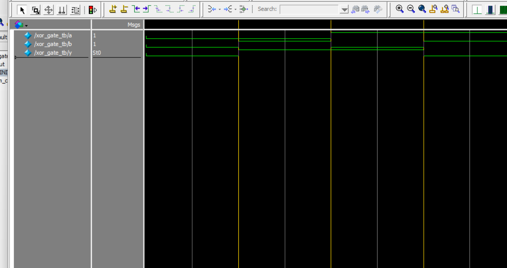

# XOR Gate Simulation (Verilog + ModelSim)

This project demonstrates the implementation and simulation of an XOR logic gate using Verilog HDL and ModelSim. It includes the gate module, a testbench, simulation outputs, and a waveform screenshot.

---

## 📁 File Structure
.  
├── xor_gate.v         # XOR gate logic in Verilog  
├── xor_gate_tb.v      # Testbench to simulate the XOR gate  
├── monitor_log_xor.txt  # Textual output from the simulation  
└── wave_xor_tb.png    # Screenshot of waveform output in ModelSim  

---

## ✅ Test Cases

| a | b | y (a ^ b) |
|---|---|-----------|
| 0 | 0 | 0         |
| 0 | 1 | 1         |
| 1 | 0 | 1         |
| 1 | 1 | 0         |

---

## 🖥️ Simulation Commands (ModelSim)

```tcl
vlib work
vlog src/xor_gate.v tb/xor_gate_tb.v
vsim work.xor_gate_tb
add wave *
run -all
```
## 📷 Waveform



### 📝 Notes

- Run the testbench in ModelSim to generate `monitor_log_xor.txt` and `wave_xor_tb.png`.
- Make sure `xor_gate.v` and `xor_gate_tb.v` paths are correctly set.
- For waveform output, use `$dumpfile` and `$dumpvars` in your testbench.
